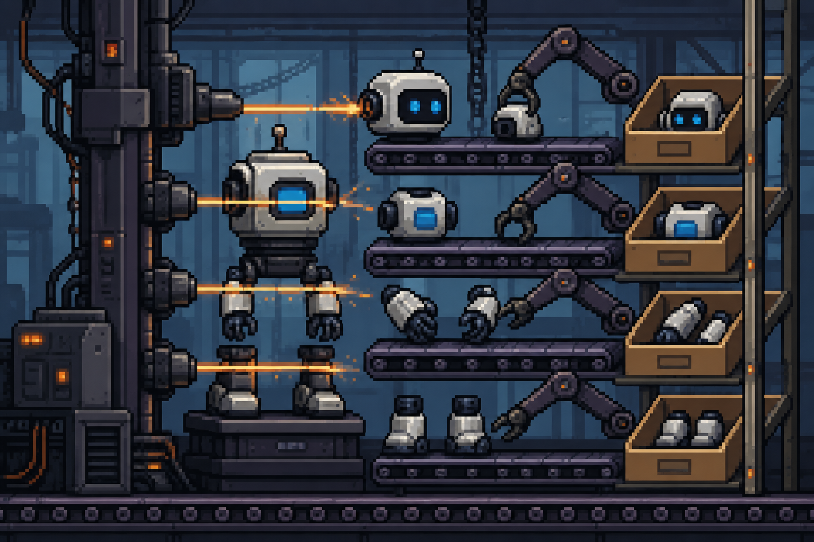

# BONUS Lab 03: Token Counter 🔢


## Introduction

When you send a message to an AI model, it does not process words. It processes **tokens**. Understanding how tokenisation works is one of the most practical skills you can build as a developer working with AI, and it directly connects to everything you learned in the previous two labs about LLM pricing and context windows.

In this lab you will write your first JavaScript logic from scratch. There is no styling, no user interaction, and no DOM manipulation yet. The entire focus is on thinking like a programmer: breaking a problem into small focused functions, testing your logic with `console.log`, and building something that actually produces a correct result.

By the end you will have a working token estimation engine for English text and a new page called **Token Counter** ready to be wired up in the next lab.

<br>

## Learning Objectives

By the end of this lab you will be able to:

* Declare variables using `const` and `let`
* Write reusable functions that accept parameters and return values
* Use string methods such as `.trim()`, `.split()`, and `.replace()`
* Work with arrays and use `.filter()` to clean up unwanted items
* Use `console.log()` to test and verify your logic at every step
* Explain what a token is and how to approximate a token count for English text

<br>

## Getting Started

### Fork the repository

1. Click the **Fork** button at the top right of this repository page on GitHub.
2. This will create a copy of the repo under your own GitHub account.

### Previous work

You are going to be working in the same project. You don't need to fork and clone again. 

<br>

## Part 1: Understanding Tokens

### Step 1: What Is a Token?

In English, a token is roughly **three to four characters**, or about **three quarters of a word** on average. OpenAI, Anthropic, and other providers all use variations of this rule to calculate pricing and context limits. That is why you saw prices expressed as "per 1 million tokens" in the comparison table you built in Lab 01.

Here are a few examples to build your intuition:

| Text | Approximate token count |
|------|------------------------|
| Hello | 1 |
| Hello, world! | 3 |
| The quick brown fox | 4 |
| I am learning JavaScript today | 6 |

The exact number depends on the tokeniser each model uses internally. For this lab you will build a **practical approximation** that is accurate enough for real use cases.

<br>

### Step 2: Plan Your Approach

Before writing a single line of code, read through the following plan:

1. Take a string of English text as input
2. Remove extra whitespace from the beginning and end
3. Split the text into an array of words
4. Remove any empty items from the array (caused by double spaces)
5. Count the words and multiply by **0.75** to get the approximate token count
6. Round up to the nearest whole number so you never undercount

This is the logic you will implement one step at a time.

<br>

## Part 2: Writing the Logic

Create a new file called `tokenCounter.js`. All the code in this section goes inside that file.

<br>

### Step 3: Clean the Input

Write a function called `cleanText` that takes a string and returns it with leading and trailing whitespace removed.

```js
function cleanText(text) {
  return text.trim();
}
```

Test it immediately below the function definition:

```js
console.log(cleanText("  Hello world  "));
```

You should see `Hello world` in the console with no extra spaces at either end. Always test each function before moving on to the next one.

<br>

### Step 4: Split Into Words

Write a function called `splitIntoWords` that takes a cleaned string and returns an array of individual words by splitting on spaces.

```js
function splitIntoWords(text) {
  return text.split(" ");
}
```

Test it:

```js
console.log(splitIntoWords("The quick brown fox"));
```

You should see an array: `["The", "quick", "brown", "fox"]`.

<br>

### Step 5: Remove Empty Items

When a string has two or more spaces between words, `.split(" ")` creates empty string items in the array. Write a function called `removeEmptyWords` that filters those out using `.filter()`.

```js
function removeEmptyWords(words) {
  return words.filter(function(word) {
    return word !== "";
  });
}
```

Test it with a messy string so you can see the difference:

```js
const messy = splitIntoWords("Hello   world");
console.log(messy);
console.log(removeEmptyWords(messy));
```

The first log will show the empty items. The second will show only `["Hello", "world"]`.

<br>

### Step 6: Count the Tokens

Write a function called `estimateTokens` that takes an array of clean words and returns the estimated token count. Multiply the word count by **0.75** and round up using `Math.ceil` so you always return a whole number.

```js
function estimateTokens(words) {
  return Math.ceil(words.length * 0.75);
}
```

Test it:

```js
const words = ["The", "quick", "brown", "fox"];
console.log(estimateTokens(words));
```

You should see `3`.

<br>

### Step 7: Put It All Together

Now write a main function called `countTokens` that accepts a raw string and runs it through all the previous functions in the correct order.

```js
function countTokens(text) {
  const cleaned = cleanText(text);
  const words = splitIntoWords(cleaned);
  const filtered = removeEmptyWords(words);
  return estimateTokens(filtered);
}
```

Test it with several different strings and check that the results make sense:

```js
console.log(countTokens("Hello"));
console.log(countTokens("Hello, world!"));
console.log(countTokens("The quick brown fox jumps over the lazy dog"));
console.log(countTokens("  I am learning JavaScript   today  "));
```

Take a moment to manually verify each result using the 0.75 rule. If any number surprises you, add more `console.log` calls inside the function to trace exactly what is happening at each step.

<br>

## Part 3: Build the Token Counter Page

### Step 8: Create the HTML Structure

Create a new file called `tokenCounter.html`. Give it the same structure as your other pages: the same `<header>`, `<nav>`, `<footer>`, and the same linked `styles.css`.

Inside `<main>`, add a single section:

```html
<section id="tokenCounter">
  <h2>Token Counter</h2>
  <p>Paste any English text below to estimate how many tokens it would consume when sent to an AI model.</p>
  <textarea id="inputText" rows="6" placeholder="Type or paste your text here..."></textarea>
  <p id="result">Estimated tokens: 0</p>
</section>
```

Do not worry about connecting the textarea to your JavaScript yet. That comes in the next lab when you learn DOM manipulation. For now, the page is just a container waiting to be brought to life.

<br>

### Step 9: Link the Script

At the bottom of `tokenCounter.html`, just before the closing `</body>` tag, add:

```html
<script src="tokenCounter.js"></script>
```

This tells the browser to load and run your JavaScript file when the page opens. Open `tokenCounter.html` in your browser and check the console. You should see all your `console.log` results appear automatically.

<br>

### Step 10: Update the Navigation

In the `<nav>` of all your existing pages (`index.html` and `how-it-works.html`), add a link to the new page:

```html
<a href="tokenCounter.html">Token Counter</a>
```

In the `<nav>` of `tokenCounter.html`, add links back to both existing pages:

```html
<a href="index.html">Dashboard</a>
<a href="how-it-works.html">How It Works</a>
```

Test that all three pages link to each other correctly.

<br>

## HTML File Structure

Your `tokenCounter.html` must include this structure:

```
<header> ... </header>
<nav> ... </nav>
<main>
  <section id="tokenCounter"> ... </section>
</main>
<footer> ... </footer>
```

Your navigation across all three pages must link to:

* `index.html` 
* `how-it-works.html`
* `tokenCounter.html`

<br>

## Bonus Challenges

* Write a second function called `estimateCost` that accepts a token count and a price per million tokens, and returns the estimated cost in USD. Test it using the prices from your comparison table: how much would a 500 word email cost on each model?
* Write a function called `characterCount` that returns the total number of characters in the cleaned text, not counting the leading and trailing spaces
* Try testing your `countTokens` function with a sentence in another language. Does the result still feel accurate? Why might it be different?

<br>

:heart: **Happy coding!** In future labs you will connect this logic to the page using DOM manipulation, so users can type text and see the estimated token count update as they write.
